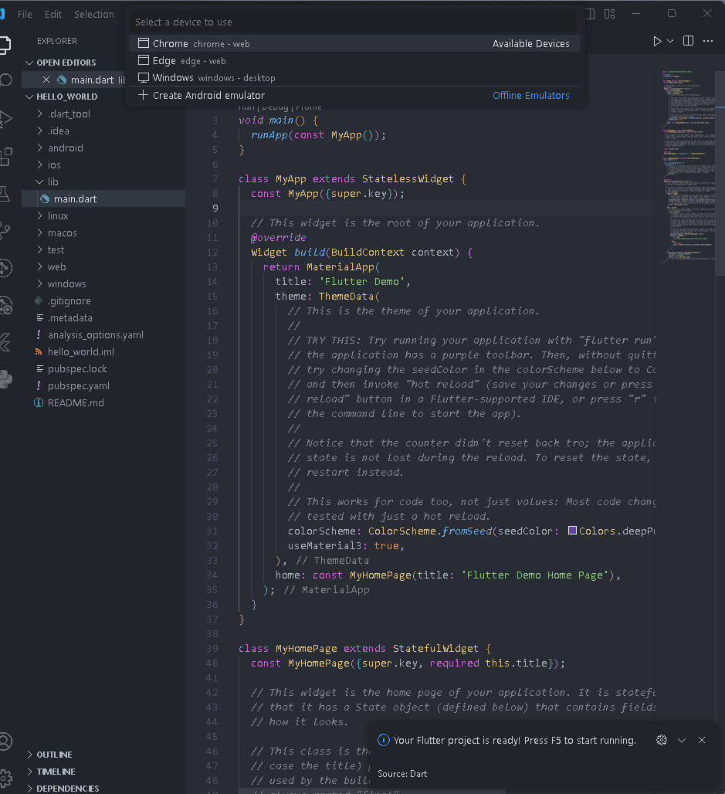
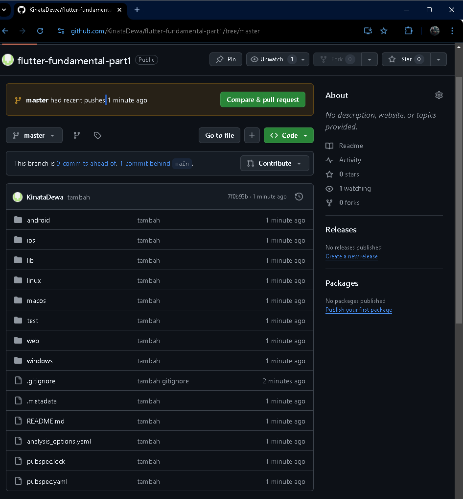
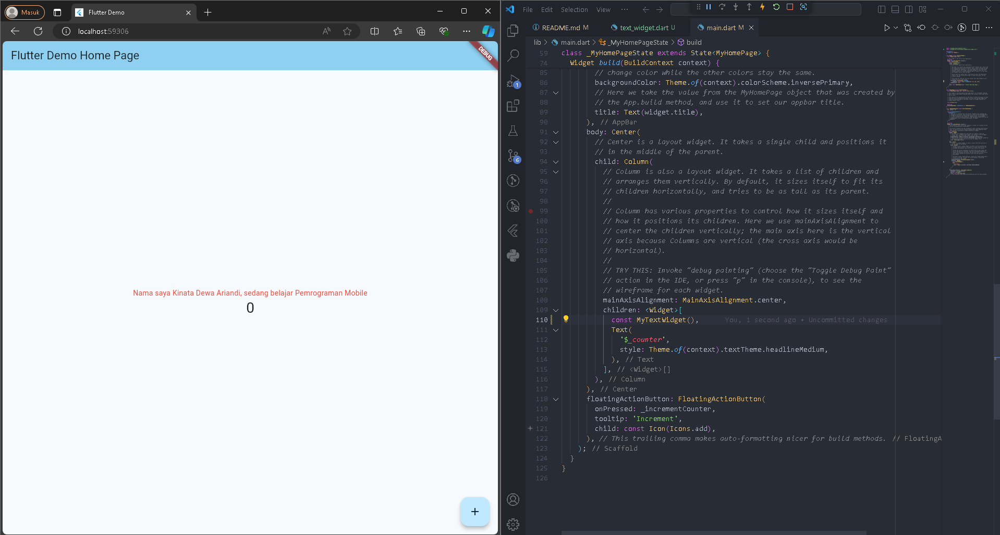
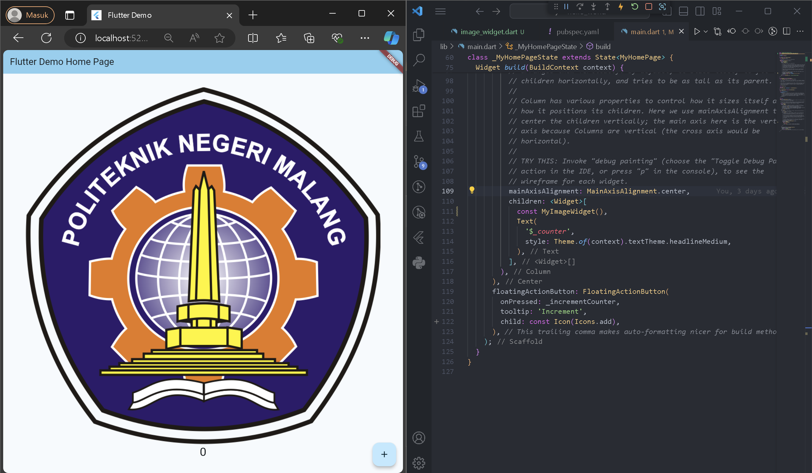

# Laporan Praktikum

NIM : 2241720087  
Nama : Kinata Dewa Ariandi  
Kelas : TI 3B

#

## Praktikum 1: Membuat Project Flutter Baru

New Aplication Project

## Praktikum 2: Menghubungkan Perangkat Android atau Emulator

## Praktikum 3: Membuat Repository GitHub dan Laporan Praktikum

### langkah 12

## Praktikum 4: Menerapkan Widget Dasar
### Langkah 1: Text Widget

### Langkah 2: image Widget

## Praktikum 5: Menerapkan Widget Material Design dan iOS Cupertino
